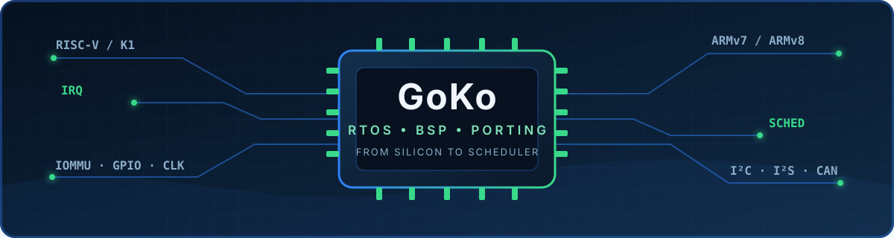

  

  

  

    
    
    
    
    
  

## About me

<h3>🧩 RTOS developer currently based in Norway</h3>

I work at the boundary between **processor architecture**, **operating-system kernels**, and **hardware peripherals**. I enjoy following a system from reset and exception entry through interrupt handling, context switching, scheduling, and driver integration.

<table>
  <tr>
    <td width="50%" valign="top">
      <h3>⚙️ Current work</h3>
      
RTOS development, architecture adaptation, BSP work, and low-level platform integration.

    </td>
    <td width="50%" valign="top">
      <h3>🛰️ RISC-V experience</h3>
      
A year of work on <strong>RISC-V SoC development</strong>, contributing focused patches across I²C, I²S, IOMMU, pinctrl, GPIO, and clock subsystems.

    </td>
  </tr>
  <tr>
    <td width="50%" valign="top">
      <h3>🎓 Foundations</h3>
      
STM32 development and source-level study of RTOS scheduling, synchronization, interrupts, and context switching.

    </td>
    <td width="50%" valign="top">
      <h3>🧭 In progress</h3>
      
ARMv7-A/Cortex-A9 RTOS porting, ARMv8 architecture study, and CAN bus integration on RTOS.

    </td>
  </tr>
</table>

## Core systems

  
  
  
  
  
  
  
  

### Platforms, kernels, and interfaces

### Languages, tools, and environments

## Featured work

<table>
  <tr>
    <td width="50%" valign="top">
      <h3>☕ <a href="https://github.com/GoKo-Son626/caffeinix">Caffeinix</a></h3>
      
A RISC-V Unix-like system project exploring kernel construction, cross-compilation, QEMU, and root filesystems.

    </td>
    <td width="50%" valign="top">
      <h3>🌐 <a href="https://github.com/GoKo-Son626/sdf">SDF Translator</a></h3>
      
A lightweight Linux desktop translator with global selection capture, multiple AI providers, graceful fallback, and privacy guardrails.

    </td>
  </tr>
</table>

  
  

## GitHub activity

  
  

  

### Contribution snake

  
  

<picture>
  <source media="(prefers-color-scheme: dark)" srcset="https://raw.githubusercontent.com/GoKo-Son626/GoKo-Son626/output/github-contribution-grid-snake-dark.svg" />
  <source media="(prefers-color-scheme: light)" srcset="https://raw.githubusercontent.com/GoKo-Son626/GoKo-Son626/output/github-contribution-grid-snake.svg" />
  
</picture>

Automatically refreshed every four hours. Use the button above for an on-demand refresh; GitHub may take a short time to update its contribution data and image cache.

  Building upward from registers, interrupts, and context switches.

