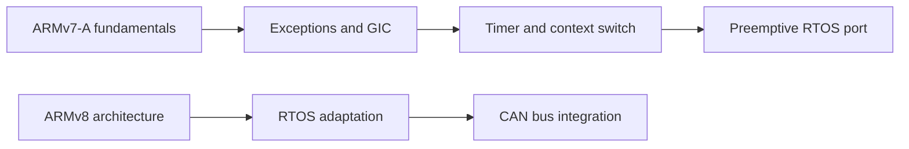

  

  

  

    
    
    
    
  

## About me

I am an **RTOS developer in China** focused on the boundary between processor architecture, operating-system kernels, and hardware peripherals. I enjoy following a system from reset and exception entry through interrupt handling, context switching, scheduling, and driver integration.

- 💼 **Current work:** RTOS development, architecture adaptation, and low-level platform work.
- 🛰️ **RISC-V experience:** During a year-long internship in my senior year, I contributed to platform and driver development for the **SpacemiT K1 RISC-V SoC**. My work touched **I²C (IIC), I²S (IIS), IOMMU, pinctrl, GPIO, and clock** subsystems, with focused patches across the stack.
- 🎓 **Foundations:** Studied **STM32 development** and read RTOS kernel source code to understand scheduling, synchronization, interrupts, and context switching from the implementation level.
- 🧭 **Current learning:** Studying **ARMv7-A/Cortex-A9** while preparing and implementing an RTOS port; learning **ARMv8** with the longer-term goal of porting RTOS systems and integrating **CAN bus** support.
- 🤝 **Interests:** RTOS kernels, BSP/SoC bring-up, device drivers, CPU architecture, Linux internals, and embedded open source.

## Engineering focus

| Area | Experience and direction |
| --- | --- |
| **RTOS & kernels** | Scheduling, context switching, interrupts/exceptions, synchronization, timers, and source-level study |
| **Architectures** | RISC-V; ARMv7-A/Cortex-A9 porting; ARMv8 learning |
| **Platforms** | SpacemiT K1, STM32F103, STM32MP157, Zynq-7020 |
| **Subsystems** | I²C/IIC, I²S/IIS, IOMMU, pinctrl, GPIO, clocks, Device Tree, CAN |
| **Bring-up & debug** | Cross-compilation, QEMU, GDB, boot flow, GIC, timers, and board-level debugging |

## Current porting roadmap

## Technology stack

### Languages and formats

### Architectures, kernels, and platforms

### Drivers and interfaces

### Build, debug, and workflow

## Selected work

| Project | What it represents |
| --- | --- |
| [**Caffeinix**](https://github.com/GoKo-Son626/caffeinix) | A RISC-V Unix-like system project for exploring kernel construction, cross-compilation, QEMU, and root filesystems. |
| [**xv6 Chinese Comments**](https://github.com/GoKo-Son626/xv6-chinese-comments) | Source-level study of xv6-riscv, including boot, traps, spinlocks, virtual memory, scheduling, and context switching. |
| [**STM32F103**](https://github.com/GoKo-Son626/STM32F103) | STM32/Cortex-M3 learning notes, reference material, and board-level experiments. |
| [**Kernel Way**](https://github.com/GoKo-Son626/kernel-way) | Notes on Linux, Device Tree, kernel workflows, and Banana Pi F3/K1 platform work. |
| [**LAVA for RISC-V**](https://github.com/GoKo-Son626/lava-webserver-riscv) | LAVA and KernelCI-oriented boot/deployment automation for RISC-V boards, including Banana Pi F3. |

  
  

## GitHub activity

  
  

  

<picture>
  <source media="(prefers-color-scheme: dark)" srcset="https://raw.githubusercontent.com/GoKo-Son626/GoKo-Son626/output/github-contribution-grid-snake-dark.svg" />
  <source media="(prefers-color-scheme: light)" srcset="https://raw.githubusercontent.com/GoKo-Son626/GoKo-Son626/output/github-contribution-grid-snake.svg" />
  
</picture>

  Building upward from registers, interrupts, and context switches.

